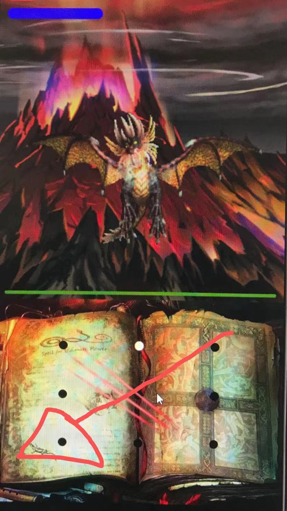
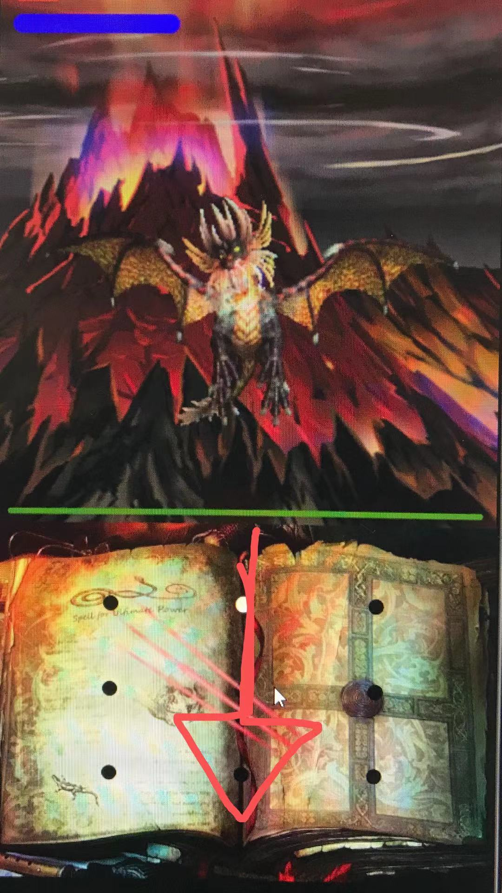

# MageSimulator

Fight against Onyxia the black dragon by drawing out spells on your phone!

Inspried by World of Warcraft lores and comics, the game play is similar to a boss raid

# Running the project

Option 1:
Open the project in android studio and click run, with api 29

Option 2:
Drag and drop the MageSimulator.apk file under app/ folder to your emulator to install directly

# Game Mechanic 
Draw your defensive spells on the spellbook to block her attacks\
shield only blocks same element attacks successful block can prevent damage while generate HP and Mana \
She changes type occasionally(The game world changes accordingly)\
Use the correct type deals 2x damage!!

# Defensive Spells
Cast this spell against fire attack\

Cast this spell against water attack\

Cast this spell against dragon attack\

# Offensive Spells
Start with column one to cast fire spells (good against water type)\
Start with column two to cast water spells (good against fire type)\
Start with column three to cast meteor strike (good against space type)

