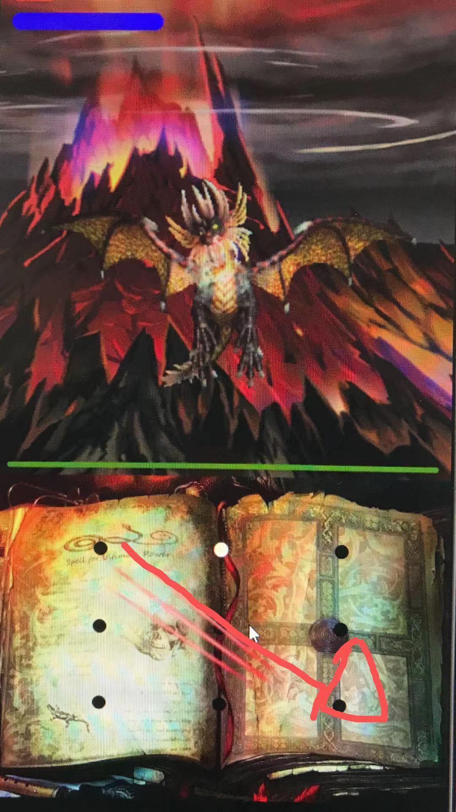

# MageSimulator

Fight against Onyxia the black dragon by drawing out spells on your phone!

# Running the project

Option 1:
Open the project in android studio and click run, with api 29

Option 2:
Drag and drop the MageSimulator.apk file under app/ folder to your emulator to install directly

# Game Mechanic
Draw your defensive spells on the spellbook to block her attacks,
shield only blocks same element, successful block can prevent damage while generate HP and Mana 

SPEND YOUR MANA on powerful spell to defeat the evil dragon

She changes type occasionally(The game world changes accordingly)
fire attack is good against ice type
ice attack is good against fire type
Meteor strike is good against dragon type

Use the correct type deals 2x damage!!

Cast this spell against fire attack

